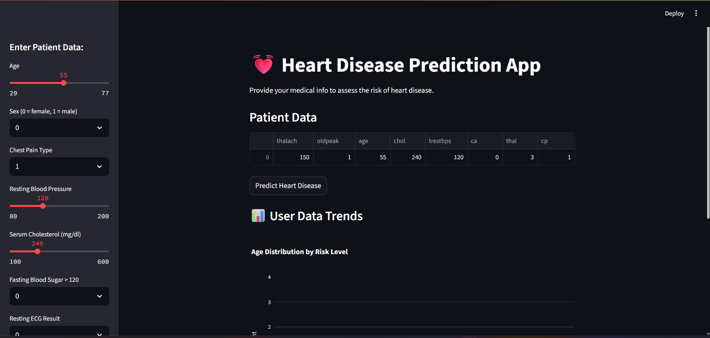

# 💓 Heart Disease Prediction Web App

This is a machine learning–based web application that predicts the likelihood of heart disease based on user-provided medical data. It is developed using **Python**, **Streamlit**, and **scikit-learn**, and includes dynamic data visualization with **Plotly**.

---

## 🚀 Features

- ✅ Predict heart disease risk using a trained ML model
- ✅ Real-time prediction based on 13 medical input features
- ✅ Displays prediction confidence score
- ✅ Stores user predictions in a CSV file for trend analysis
- ✅ Generates interactive visualizations (age vs risk, prediction counts)
- ✅ Lightweight, fast, and easy to deploy with Streamlit

---

## 🧠 Machine Learning Pipeline

1. **Data Source**: UCI Heart Disease dataset  
2. **Preprocessing**:
   - Null value removal (from `ca` and `thal`)
   - Converted multi-class target to binary (0 = low risk, 1 = high risk)
3. **Feature Selection**:
   - Random Forest importance
   - Recursive Feature Elimination (RFE)
   - Chi-Square test
4. **Model Training**:
   - Logistic Regression (achieved ~91% accuracy)
   - Other models tested: Decision Tree, Random Forest, SVM
5. **Deployment**:
   - Model saved as `heart_disease_model.pkl` using `pickle`
   - Integrated with a user-friendly Streamlit interface

---

## 🖥️ Installation & Run Locally

### 1. Clone the repository

```bash
git clone https://github.com/yourusername/heart-disease-predictor.git
cd heart-disease-predictor
```

### 2. Create a virtual environment (optional)

```bash
python -m venv venv
source venv/bin/activate  # On Windows: venv\Scripts\activate
```

### 3. Install dependencies

```bash
pip install -r requirements.txt
```

### 4. Run the Streamlit app

```bash
streamlit run app.py
```

---

## 📁 Project Structure

```
heart-disease-predictor/
│
├── app.py                     # Main Streamlit application
├── heart_disease_model.pkl    # Trained machine learning model
├── user_data_log.csv          # Log of all user predictions
├── requirements.txt           # Python dependencies
└── README.md                  # Project documentation
```

---

## 📊 Visualizations Included

- Heart disease prediction counts (0 vs 1)
- Age distribution by prediction class
- Additional visualizations can be added (e.g., cholesterol, sex)

---

## 🔐 Input Features

- age
- sex
- cp (chest pain type)
- trestbps (resting blood pressure)
- chol (cholesterol)
- fbs (fasting blood sugar)
- restecg (resting ECG)
- thalach (max heart rate)
- exang (exercise-induced angina)
- oldpeak (ST depression)
- slope (ST slope)
- ca (vessels colored)
- thal (thalassemia)

---

## 📷 Screenshot



---

## 📜 License

This project is licensed under the MIT License.

---

## 👤 Author

Developed by **[Your Name]** — Machine Learning Engineer & Software Developer  
If you use this app in your work or research, feel free to reach out or give credit.

---

## 🌐 Deployment Options

You can deploy this app to:
- [Streamlit Cloud](https://streamlit.io/cloud)
- Heroku / Render
- As a desktop app using PyInstaller

---

## 📝 Notes

- The prediction output is binary:  
  `0 = Low Risk`, `1 = High Risk`
- `user_data_log.csv` auto-generates upon first prediction
- Make sure the model and features are aligned (same column order)

---

## 📦 Example Requirements (requirements.txt)

```
streamlit
scikit-learn
pandas
numpy
matplotlib
seaborn
plotly
ucimlrepo
```

> You can generate this automatically with `pip freeze > requirements.txt`

---

Enjoy building! 🚀
